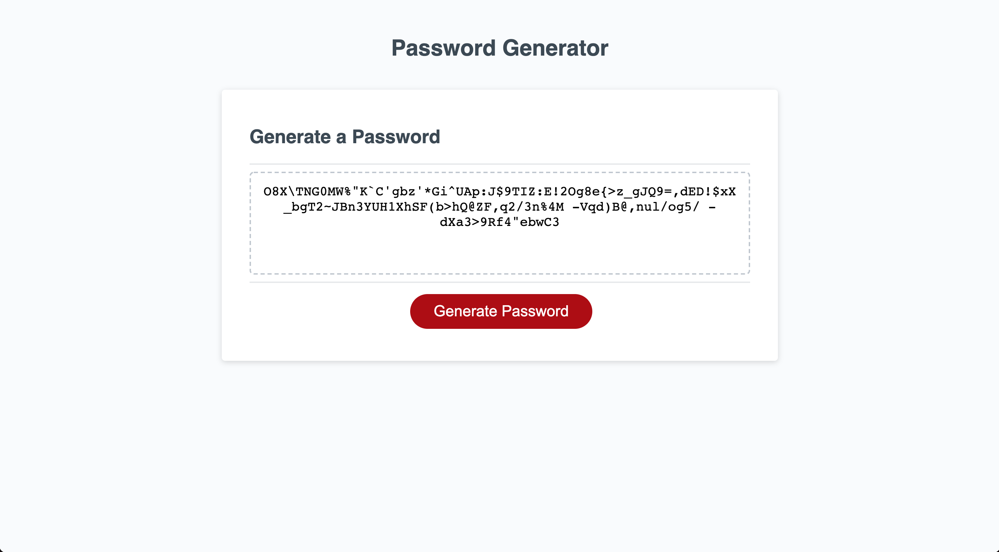

# Random Password Generator

## About the Website
This website generates a random password for a user. It allows the user to both select a length of the password (must be between 8 and 128 characters), and to apply various filters for the type of password. For example the user can chose whether or not to include lowercase or uppercase letters, or whether they want numbers and special characters included.

Then finally, after the random password is generated, it will display the password in a textbox to allow for easy copy/paste for the user.

## Deployment

Link to webpage: https://vitaliytrach.github.io/password-generator/

Link to source code: https://github.com/vitaliytrach/password-generator

## Screenshots

Example of a 128 character password generated, with all password criterias (uppercase, lowercase, numbers and special characters) enabled.

